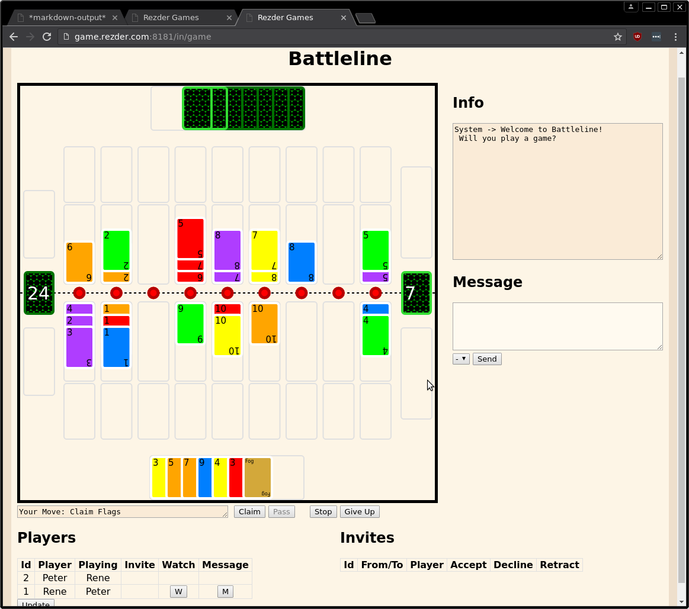

# go-battleline

The repository contain my implementation of the two person card game battleline.


## Main packages:

###/battleline###
Contain the game logic. It is as simple as possible. The **battleline.Game** struct:

``` 
type Game struct {
	PlayerIds     [2]int
	Pos           *GamePos
	InitDeckTac   deck.Deck
	InitDeckTroop deck.Deck
	Starter       int
	Moves         [][2]int
}
```

It contains who is playing, the current position, the decks, who starts and the moves so fare.

The position holds all the information that describe a position and all the possible moves in that position. The moves are just indexes to one of the possible move. The index is a double index where the first index is only used if the move involve playing a card from the hand. In that case it is the index of the card. All cards is represented by a index value.

You create the game, you start the game and you move.
```
game:=battleline.New()
game.Start(i)
game.Move(moveIndex)
game.MoveHand(cardIndex,MoveIndex)
```
The i is the index of the player that move first 0 or 1.

The game code is finished, I hope. Only one thing may change in the future, the handling of the mud card when it is deserted or redeployed. When this happen it may leave 4 cards on a flag where only 3 is needed. The rules does not specify what to do with the excess cards. Currently I am just dishing the worst card but I do not like that solution.


### /battserver
It creates a command. The command starts a http game server that listen by default on port 8181 where you can login and invite others to play. To run it, the server needs a **data** folder with read and write access to save user login and unfinished games and the different html files located in the two folders **github.com/rezder/go-battleline/battserver/html/pages** and **github.com/rezder/go-battleline/battserver/html/static**

So to run create the **data** folder in **github.com/rezder/go-battleline/battserver** and start the server from here `battserver` or create the data folder and a html folder where you will run the server and copy the static and pages folder to the html folder. `battserver --help` list option including the port.
```
/battserver]$ mkdir data
/battserver]$ battserver
Server up and running. Close with ctrl+c
```
or 

```
/launch]$ mkdir data
/launch]$ mkdir html
/launch]$ cd html
/launch]$ cp -r $GOPATH/src/github.com/rezder/go-battleline/battserver/html/static .
/launch]$ cp -r $GOPATH/src/github.com/rezder/go-battleline/battserver/html/pages .
/battserver]$ battserver
Server up and running. Close with ctrl+c
```

The server is just an example it of course needs to use https and I have not finished the watch other player functionalty. The javascript implementation is missing so the watch functionalty is not well tested. The javascript is only for a chrome browser but it also work on my fire tablet and I am having fun playing.

The java script must wait I will be working on a bot next.

## Info.
This is my first program in go so the code is not consistent as I am trying to learn new things and therefore may code the same thing in multiple ways. It is also my first javascript, css and html and I am taking spacemacs for its first spind.
I do not like front end code never did. I like the go code syntax and the channels but I do think that the lack of version support is going to be a challenge. "go get" combined with github not have directories for repository is bad both of them.




